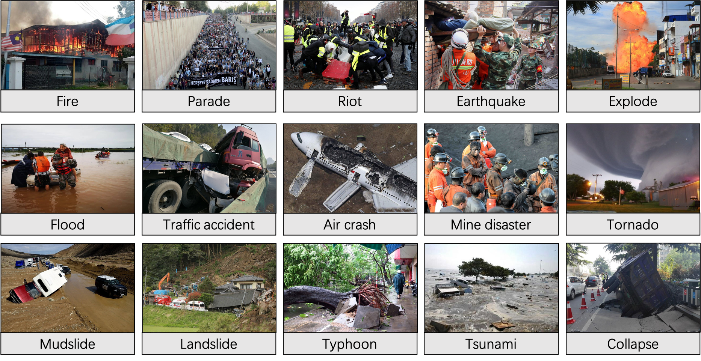

# News image caption dataset (CDNIC19k)
The current version of CDNIC19k dataset provides over 19,000 images across 15 categories of disasters. 

## Annotation format
The annotations include the news category of breaking disaster, the location of news object, and the Chinese caption.
```
{'news_type':xxx,
 'object_annotation':[{'coordinate':xxx,
                     'object_label':xxx},
                     ...
                    ],
 'sentence_annotation':[xxx,],
 'image_name':xxx,
 ...
}
```
## Download
Due to image copyright issues, CDNIC19k is for scientific research using only.
[baiducloud](https://pan.baidu.com/s/1kLhOX-nQBZGKwBa43U87uQ) code:49gv

## Images of CDNIC19k

